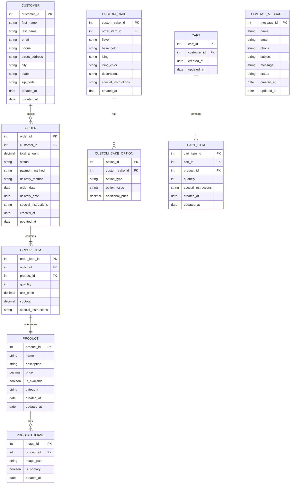

```mermaid
erDiagram
    CUSTOMER ||--o{ ORDER : places
    CUSTOMER {
        int customer_id PK
        string first_name
        string last_name
        string email
        string phone
        string street_address
        string city
        string state
        string zip_code
        date created_at
        date updated_at
    }
    
    ORDER ||--|{ ORDER_ITEM : contains
    ORDER {
        int order_id PK
        int customer_id FK
        decimal total_amount
        string status
        string payment_method
        string delivery_method
        date order_date
        date delivery_date
        string special_instructions
        date created_at
        date updated_at
    }
    
    ORDER_ITEM ||--|| PRODUCT : references
    ORDER_ITEM {
        int order_item_id PK
        int order_id FK
        int product_id FK
        int quantity
        decimal unit_price
        decimal subtotal
        string special_instructions
    }
    
    PRODUCT ||--o{ PRODUCT_IMAGE : has
    PRODUCT {
        int product_id PK
        string name
        string description
        decimal price
        boolean is_available
        string category
        date created_at
        date updated_at
    }
    
    PRODUCT_IMAGE {
        int image_id PK
        int product_id FK
        string image_path
        boolean is_primary
        date created_at
    }
    
    CUSTOM_CAKE ||--o{ CUSTOM_CAKE_OPTION : has
    CUSTOM_CAKE {
        int custom_cake_id PK
        int order_item_id FK
        string flavor
        string base_color
        string icing
        string icing_color
        string decorations
        string special_instructions
        date created_at
    }
    
    CUSTOM_CAKE_OPTION {
        int option_id PK
        int custom_cake_id FK
        string option_type
        string option_value
        decimal additional_price
    }
    
    CART ||--o{ CART_ITEM : contains
    CART {
        int cart_id PK
        int customer_id FK
        date created_at
        date updated_at
    }
    
    CART_ITEM {
        int cart_item_id PK
        int cart_id FK
        int product_id FK
        int quantity
        string special_instructions
        date created_at
        date updated_at
    }
    
    CONTACT_MESSAGE {
        int message_id PK
        string name
        string email
        string phone
        string subject
        string message
        string status
        date created_at
        date updated_at
    }
``` 